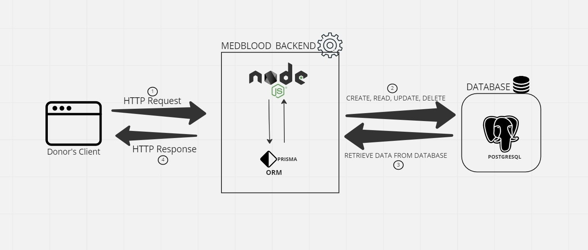

# Medblood

## Background Context

Medblood is a blood bank application. It aims to remove obstacles in checking, receiving and donating matching blood with little or no hassle.
This API was be implemented using NodeJS, Prisma and Postgresql. NodeJS is a backend JavaScript runtime environment, runs on the V8 JavaScript Engine, and executes JavaScript code outside a web browser. Prisma is an Object Relational Mapper(ORM) that makes it easy for applications to communicate with databases easily. It serves as the bridge between applications and database. In other words, instead of wrting raw SQL queries which can be daunting in most case, an ORM like prisma takes all of those away and help the application in performing CRUD operations on the database. PostgreSQL is a stable and powerful relational database system. Medblood choses NodeJs, Prisma and PostreSQL because they are powerful technologies that can serve it's users efficiently and effectively.

As you can see in the diagram above, the user makes an HTTP request to the server which is NodeJS, the server then processes it and makes a CRUD (creating, reading, updating and deleting) operation based on the HTTP request on the database which is postgresql using an ORM which is prisma and after resolving whatever task the user wants to do, it then sends back an HTTP response back to the user.

This application was developed using two schemas or models:
- Donor model - Entails the users information such as firstname, lastname, email, age, blood group, weight, password, address, state and has a one to many relationship with the donation model.
- Donation model - Entails the donation offer information such as blood group, donation date, amount and last donation date.

This application is very secure as all routes are protected. That is, users must register, verify their account, login in order to access the endpoints.

Medblood application enables users to perform the following:
- Users can view all blood types available for donation
- Users(Donors) can donate blood sample information
- Users(Donors) can update blood sample information sent initially to the database
- Users(Donors) can delete his offer because of his/her health conditions or if he or she so will.
- Users can search for any blood sample.

## Endpoints
The following are the endpoints of this application:
- **POST {URL}/api/v1/users/register** - Enable users to register
- **POST {URL}/api/v1/users/verify** - Enable users to verify their account with OTP sent to their email immediately after registration
- **POST {URL}/api/v1/users/login** - Enable users to login
- **POST {URL}/api/v1/users/request-verification** - Enable users to request verification of their account with their email address
- **POST {URL}/api/v1/users/donate** - Enable users to make donation offer. This endpoint is protected as users must be logged in and must be verified before accessing this endpoint.
- **GET {URL}/api/v1/users/donations** - Enable users to view all donations made in the application. This endpoint is protected as users must be logged in before accessing this endpoint
- **GET {URL}/api/v1/users/donation** - Enable users who have made donation offer to view their donation offer. This endpoint is protected as users must be logged in and verified before accessing this endpoint. 
- **GET {URL}/api/v1/users/search** - Enable users to search for any blood sample. This endpoint is also protected.
- **PUT {URL}/api/v1/users/donation/:donation_id** - Enable users to update their donation offer with their donation id. This endpoint is also protected.
- **DELETE {URL}/api/v1/users/donation/:donation_id** - Endable users to delete their donation offer with their donation id. This endpoint is also protected.

## How to use this API
This API is open source so anyone is allowed to use it with the following steps 😊:
1. You need to have NodeJS installed on your local machine.
2. You need to use yarn if you don't already have it downloaded globally on your local machine. If you don't, open your terminal and type the following command:
```
npm install -g yarn
```
3. You need to have postgreSQL also installed on your local machine, you can as well have MYSQL or any other relational database and it will still work.
4. Ensure to fork or clone this repository into your local machine
5. Install all the dependencies and dev dependencies using yarn:
```
yarn
```
6. Now you need to create a database in postgreSQL terminal after successfully logging in to postgreSQL using the following:
```
CREATE DATABASE medblood;
```
7. You need to create a a .env file and ensure to enter SMTP and JWT SECRET details:
```
DATABASE_URL="postgresql://postgres:<password>@<URL>:5432/medblood"
PORT=****
SMTP_PASSWORD=*******
SMTP_USER=********
SMTP_HOST=******
JWT_SECRET=********
JWT_EXPIRY=***
```
Ensure to replace the fields with * with your own details. Remember to also input your postgresql password and also the url of your choice e.g ```localhost```

8. Use Prisma migrate command to create the table in medblood database you created in PostgreSQL:
```
npx prisma migrate dev --name init
```
9. Now you are good for the final step. Run your server:
```
yarn start
```
viola 😊😊😊 you are good to go. Ensure to let me know if you have any issue with this API. I'm always open for corrections as it will enable learn more 😊.

## API Documentaion
Please click the link below to refer to the postman API documentation:
- [API documentation](https://documenter.getpostman.com/view/25460695/2s93K1pzYQ)